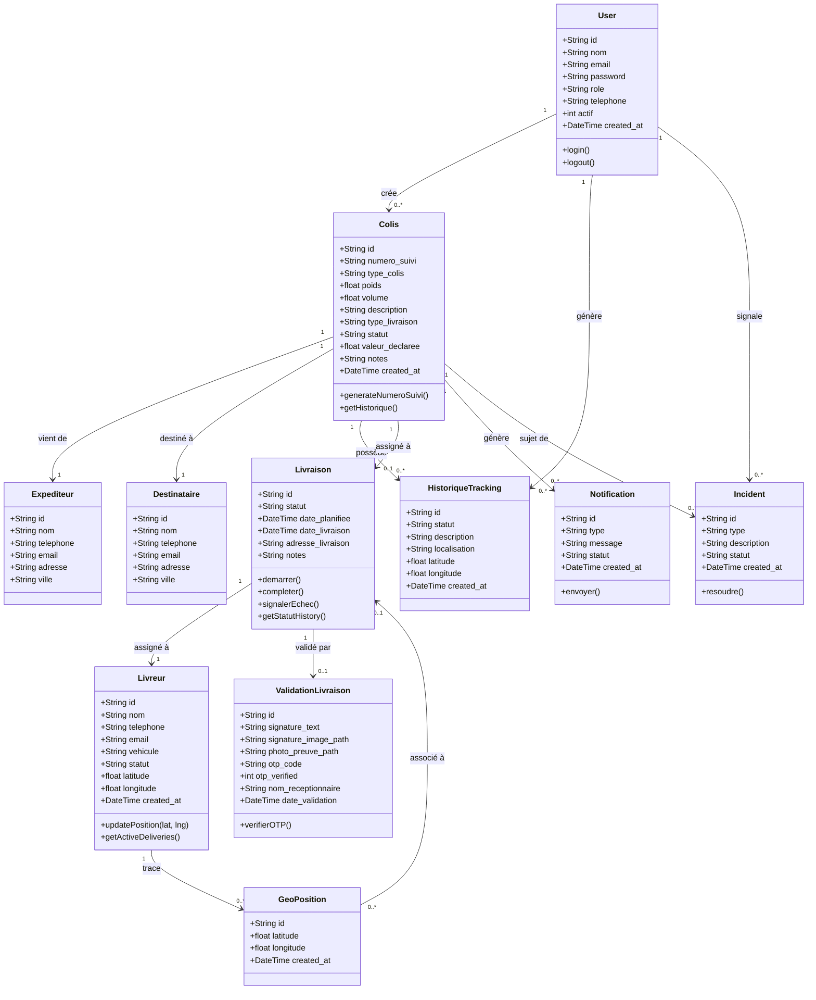

# TrackPro — Diagramme des Classes

## Rôles et Accès

| Classe | Admin | Agent | Client |
|--------|-------|-------|--------|
| User (CRUD) | ✅ | ❌ | ❌ |
| Colis (CRUD) | ✅ | ✅ | 🔍 Ses colis |
| Livraison | ✅ | ✅ | ❌ |
| Livreur | ✅ | ✅ | ❌ |
| Incident | ✅ | ✅ | ❌ |
| Rapport | ✅ | ✅ | ❌ |
| Tracking public | ✅ | ✅ | ✅ |
