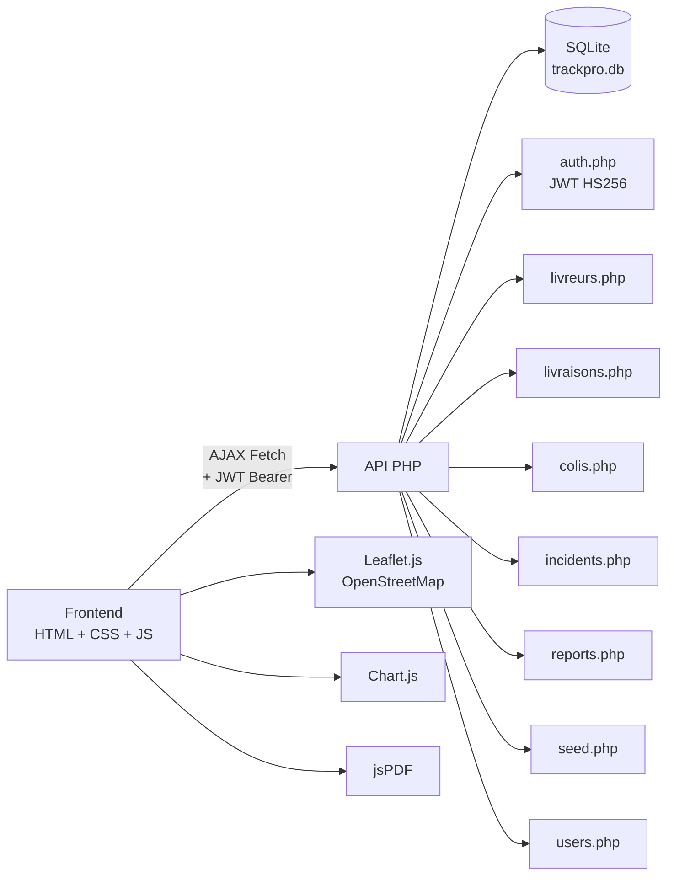

# TrackPro — Diagramme des Fonctionnalités

## Vue d'ensemble des flux

Voici la représentation visuelle du flux opérationnel et des différents parcours par rôle (Admin, Agent, Client).

## Fonctionnalités par module

| Module | Fonctionnalités |
|--------|----------------|
| **Auth** | Login JWT, Quick Login x3 rôles, Token expiry check |
| **Colis** | CRUD complet, numéro suivi auto, types multiples, historique timeline |
| **Livraisons** | Planification, démarrage, validation OTP/signature, gestion échecs |
| **Livreurs** | CRUD, vérification livraisons actives avant suppression, géolocalisation |
| **Incidents** | Signalement par type, résolution avec statut, liaison colis |
| **Rapports** | Stats mensuelles 6 mois, perf livreurs, export CSV + PDF |
| **Tracking** | Public (sans auth), recherche par numéro, historique complet |
| **Géoloc** | Carte Leaflet, polling AJAX 5s, markers colorés par statut |
| **Notifications** | Automatiques sur changement statut, badge compteur |
| **Utilisateurs** | CRUD admin uniquement, désactivation (pas suppression), 3 rôles |
| **Données test** | Bouton "🧪 Test" dans chaque formulaire, seed API admin |

## Architecture technique

